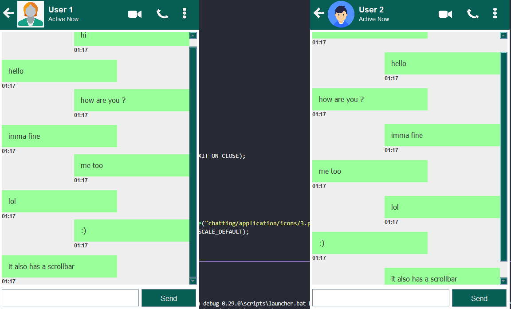

# Java Chat Application

A Java Chat Application

## Usage

1. Pull the code or clone this repo and cd into the working directory
2. If using VS code just install the redhat java extension pack and run the 2 files simultaneously. Make sure ther server file is run before the client one.
3. If using the command line open 2 separate instances and cd into the working directory in both of them. One is for Server and other is for Client
4. cd into the src/chatting/application folder in one of them and run

```bison
javac Server.java
      and
javac Client.java
```

5. cd back into the working directory
6. In the command prompt for Server, cd into src and run the command

```bison
java chatting.application.Server
```

7. In the command prompt for Client, cd into src and run the command

```bison
java chatting.application.Client
```

**Make sure it is done in this order only.**

After setting up the 2 instances you can message between them. Sometimes the message may take a while to appear because of packet loss in that case just message something else from the other client and it should work.  
&nbsp;

### A working image of the app

&nbsp;


## Functionality

It is a light weight java desktop application that allows two users to chat among themselves simultaneously much like whatsapp or any other social media application.

## Features

1. Simple & User-friendly Chat UI design.
2. Real time chatting on a given I.P Address using Socket Programming(Java Networking).
3. Additional features such as Chat Bubble, Date & Time of the messages sent & received were also added.
4. We have also included a scrollbar in our UI framework so that users can scroll back & forth between the messages.
5. The Status of the user i.e whether he is online ,typing,etc. is also shown while chatting.

## Software Features

1. Ease of use due to a robust GUI.
2. Simultaneous connectivity over a local server due to the use of web sockets.

## Made by:

1. 1911089 - Vedant Mahadik
2. 1911109 - Burhanuddin Rangwala
3. 1911093 - Neelansh Mathur


